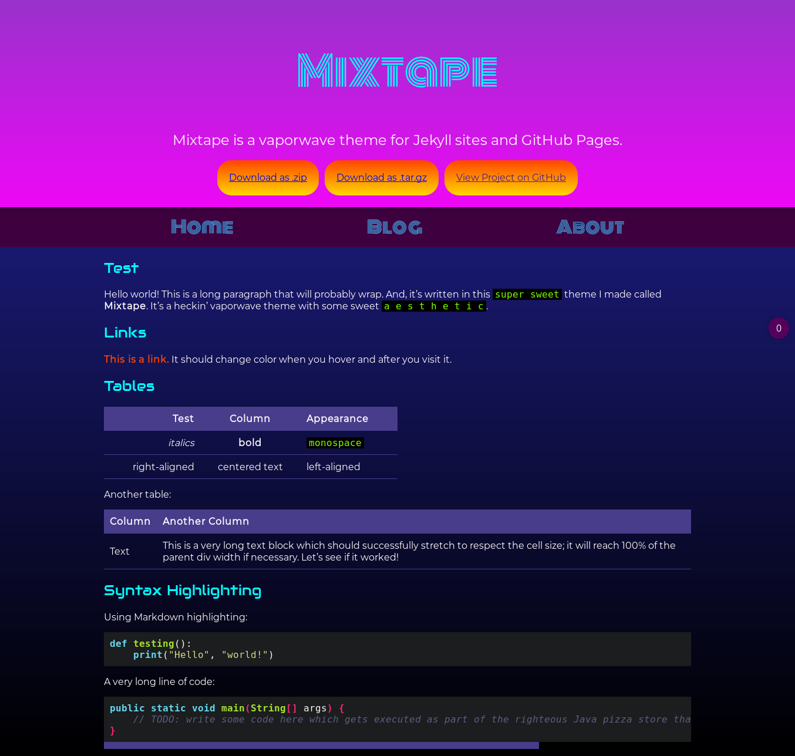

<h1 align="center">
    <br>
    
    <br>
    Mixtape
</h1>
<h3 align="center">A vaporwave theme for Jekyll sites.</h3>

<a name="philosophy"/>

## Philosophy

This project was born from a desire to have as much vaporwave 
`a e s t h e t i c` in blog sites as possible. The author also realized 
that customizing a Jekyll site is not a task for the faint at heart, and 
endeavored to give users as much flexibility as possible for displaying 
content with minimal CSS & HTML customization needed.

The project also desires to be adaptable for mobile displays, which is 
not the priority of many Jekyll layouts, especially those whitelisted as 
GitHub Pages themes. 

Lastly, the project serves as an experiment in avoiding JavaScript.

<a name="example"/>

## Example

[View a live version here.](https://lizzy.wiki/mixtape/)

| Desktop Site | Mobile Site |
|----------------------------------|-------------|
|  |  |

<a name="usage"/>

## Usage

Mixtape is not a whitelisted GitHub Pages theme. To use the Mixtape theme 
in a GitHub Pages theme, use the whitelisted 
[jekyll-remote-theme](https://rubygems.org/gems/jekyll-remote-theme):

1. Add the following to your site's `_config.yml`:

    ```yml
    remote_theme: "etcadinfinitum/mixtape"
    ```

2. Optionally, if you'd like to preview your site on your computer, add 
   the following to your site's `Gemfile`:

    ```ruby
    gem "github-pages", group: :jekyll_plugins
    ```

<a name="customization"/>

## Customization

### Configuration variables

Mixtape will respect the following variables, if set in your site's 
`_config.yml`:

```yml
title: [The title of your site]
description: [A short description of your site's purpose]
```

Additionally, you may choose to set the following optional variables:

```yml
google_analytics: [Your Google Analytics tracking ID]
```

### Configuring Navigation Bar Links

By default, the navigation bar will include 3 site links:

* A `Home` link, which will render the content in `index.md` in your site's 
  root.
* A `Blog` link, which will render the 
  [`_layouts/blog.html`](https://github.com/etcadinfinitum/mixtape/blob/master/_layouts/blog.html) 
  page, showing a list of all the posts in the `_posts` directory.
* An `About` link, which renders the content in `about.md` in your site's 
  root.

The links and labels can be customized like so:

```yml
nav_links:
  - url: /
    name: Label 1
  - url: /special
    name: Label 2
  - url: my://cool.url/
    name: Label 3
```

Navigation links will respect internal and external links.

Typically, customizing the URL for the `_posts` entry list (which is rendered 
in [`_layouts/blog.html`](https://github.com/etcadinfinitum/mixtape/blob/master/_layouts/blog.html)), 
requires defining a special path for that page and the posts under the 
`_posts` directory.

For example, if you wanted to create a development log for your site, you 
could alter the output path of the posts collection like so, and then 
change the navigation links to match the new path you chose.

```yml
# use the /devlog path for posts instead of the standard /blog path
collections:
  posts:
    permalink: "/devlog/:year/:month/:day/:title/"
    output: true

# change the navigation bar to use this new convention
nav_links:
  - url: /
    name: Home
  - url: /devlog
    name: Dev Log
  - url: /about
    name: About
```

### Configuring Header Button Links

By default, the theme will populate three buttons for GitHub Pages sites: 
the repository URL, a `.zip` download button, and a `.tar.gz` download 
button.

If the site is not deployed on GitHub Pages, no buttons will populate because 
the corresponding site variables don't exist.

#### Overriding URLs Only

Templates often rely on URLs supplied by GitHub such as links to your 
repository or links to download your project. If you'd like to override 
one or more default URLs:

1. Look at 
   [the template source](https://github.com/etcadinfinitum/mixtape/tree/master/_includes/full_header.html) 
   to determine the name of the variable. It will be in the form of 
   `{{ site.github.zip_url }}`.
2. Specify the URL that you'd like the template to use in your site's 
   `_config.yml`. For example, if the variable was `site.github.url`, 
   you'd add the following:
    ```yml
    github:
      zip_url: http://example.com/download.zip
      another_url: another value
    ```
3. When your site is built, Jekyll will use the URL you specified, rather 
   than the default one provided by GitHub.

*Note: You must remove the `site.` prefix, and each variable name (after 
the `github.`) should be indent with two space below `github:`.*

For more information, see 
[the Jekyll variables documentation](https://jekyllrb.com/docs/variables/).

#### Overriding URLs and Button Text

To set custom header links and corresponding labels, add the following to 
your site's `_config.yml`:

```yml
show_downloads: true
header_links:
  # Formatted list of link/label pairs
  - url: my://cool.url/here
    name: Label for URL 1
  - url: /my/cool/relative/site/link
    name: Label for URL 2
  - url: /
    name: Site Home
```

You can include explicit external links or relative paths for pages in your 
site. Jekyll will postprocess relative paths to expand the link as needed.

### Stylesheet

If you'd like to add your own custom styles:

1. Create a file called `/assets/css/style.scss` in your site
2. Add the following content to the top of the file, exactly as shown:
    ```scss
    ---
    ---

    @import "{{ site.theme }}";
    ```
3. Add any custom CSS (or Sass, including imports) you'd like immediately 
   after the `@import` line

*Note: If you'd like to change the theme's Sass variables, you must set 
new values before the `@import` line in your stylesheet.*

### Layouts

If you'd like to change the theme's HTML layout:

1. [Copy the original template](https://github.com/etcadinfinitum/mixtape/tree/master/_layouts/default.html) 
   from the theme's repository<br />
   (*Pro-tip: click "raw" to make copying easier*)
2. Create a file called `/_layouts/default.html` in your site
3. Paste the default layout content copied in the first step
4. Customize the layout as you'd like

Additionally, you may customize any of the default layouts or included HTML 
segments as you see fit by creating customized versions in your site's 
respective `_layouts` and `_includes` directories. 
[Theme layouts are here](https://github.com/etcadinfinitum/mixtape/tree/master/_layouts) 
and 
[theme includes are here](https://github.com/etcadinfinitum/mixtape/tree/master/_includes).

